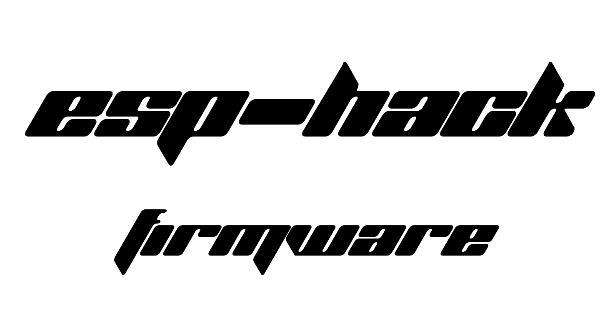
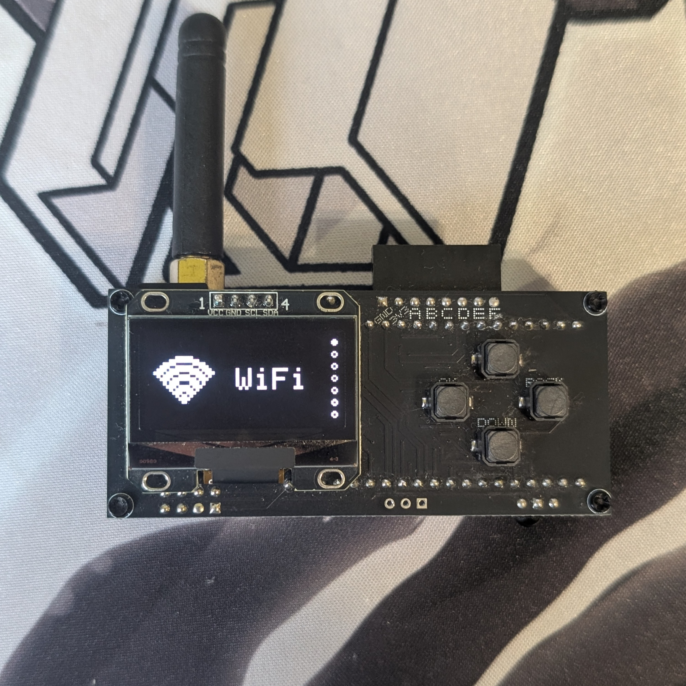

# ESP-HACK v1.3-s3 — порт на LilyGO T-Display-S3 (LCD, 2 кнопки)

Порт [ESP-HACK](https://github.com/Teapot174/ESP-HACK) с ESP32-WROOM-32 + OLED 128x64
на LilyGO **T-Display-S3** (версия **LCD**, ESP32-S3R8, 16 МБ flash, 8 МБ OPI PSRAM).

## Управление (две кнопки вместо четырёх)

| Кнопка | Короткое нажатие | Удержание (≥ 400 мс) | Очень долгое (≥ 2 с) |
|---|---|---|---|
| **BTN1** (GPIO0) | **UP** — листание вверх | **OK** — принять | дополнительно `isHolded()` |
| **BTN2** (GPIO14) | **DOWN** — листание вниз | **BACK** — назад | дополнительно `isHolded()` |

Аккорды не используются: каждая кнопка делится по длительности удержания. Тап решается
в момент отпускания, удержание — пока кнопка нажата (иначе `GyverButton` снимет флаг
клика и «принять» не сработает).

## Дисплей

ST7789 170x320 на 8-битной параллельной шине. Логический холст ESP-HACK сохранён как 128x64
и растягивается на всю панель неоднородным целочисленным масштабом (2x/3x по каждой оси),
поэтому чёрных рамок и мёртвых зон нет, а интерфейс рисуется без правок.

## Сборка

```powershell
$env:PYTHONUTF8 = '1'
python -m platformio run -e tdisplay-s3
python -m platformio run -e tdisplay-s3 -t upload
```

## Сброс после прошивки

На встроенном USB-Serial/JTAG `--after hard-reset` возвращает чип в режим загрузки.
Чтобы запустить приложение:

```powershell
python -m esptool --chip esp32s3 --port COM17 --before default-reset --after watchdog-reset read-mac
```

## Структура изменений

* `src/CONFIG.h` — новая распиновка под ESP32-S3R8 (GPIO3 намеренно не занят: стрэп-вывод JTAG).
* `src/tds3_display.{h,cpp}` — адаптер ST7789 с интерфейсом Adafruit OLED.
* `src/tds3_buttons.{h,cpp}` + `src/esp_hack_shim.h` — две кнопки → четыре логические.
* `src/GyverButton.{h,cpp}` — вендорена, чтобы её `digitalRead` шёл через шим.
* `src/display.h` — `DisplayType` → `TDS3_Display`, псевдонимы `SH110X_*`.
* `src/ble_spam.{h,cpp}`, `src/bluetooth.cpp` — миграция NimBLE 1.x → 2.x (на S3 нет Bluedroid).
* `lib/OneWireHub/src/platform.h` — `#undef MEM_SIZE` (конфликт с lwIP).
* `build.py`, `partitions_tds3.csv`, `platformio.ini` — под ESP32-S3 и 16 МБ flash.

Подробности — в `PORTING-NOTES-ru.md`.


# 📡 ESP-HACK FW — [Русский](./README-ru.md)



## 🚀 About ESP-HACK FW

ESP-HACK is a powerful universal firmware for the ESP32, built for RF research and pentesting of radio frequencies, Bluetooth, infrared signals and GPIO integrations. 
The project targets enthusiasts and pentesters who want to explore protocols and devices in Sub-GHz ranges and other wireless technologies.

[For more information, please check our wiki :)](https://teapot174.github.io/)

> *The firmware is stable within its declared functionality, but some features are marked as "in development". Use the device according to the laws in your region.*

---

### ⚠️ Disclaimer

This firmware is designed exclusively for research purposes and hardware testing.
By using the firmware, you must comply with the laws of your region. The firmware creator is not responsible for your actions. Jammers are ILLEGAL.

---

## ⚡ Features

### WiFi

- Deauth
- Beacon Spam  
- EvilPortal  
- Wardriving
- Packets

### Bluetooth

- Spam:
IOS, Android, Samsung, Xiaomi, Windows.
- BadBLE
- Mouse

### SubGHz

- Read  
- Send
- RAW (Record/Send)
- Analyzer
- Bruteforce:
Came, Nice, Ansonic, Holtek, Chamberlain
- Jammer (ILLEGAL)

### Infrared

- Send  
- Read  
- TV-B-Gone
- Universal Remote

Copy the contents of sdcard.zip to the SD card to make Universal Remote work.

### GPIO

**iButton**
- Read
- Write
- Emulate

**NRF24**
- Jammer (ILLEGAL)
- Spectrum
- Config

**ST25R3916 (soon)**
- Read
- Write
- Emulate
- Config

### Games
- Snake
- Bird
- Ping Pong
- Bricks
- "Doom"

### Settings
- Interface:
Display Color, Standby time, Menu view, Submenu view, Boot Logo.
- Restart
- Reset
- Update from SD
- About

To create a custom logo, [convert the image to a bitmap](https://pixel.hjlabs.in/converter) and upload it as a .txt file to the /bootlogo folder on the SD card.

---

### 📡 Supported SubGHz modulations
(315MHz/433.92MHz/868Mhz/915Mhz)
- Princeton  
- RcSwitch  
- Came
- Nice 
- Holtec
- Ansonic
- Chamberlain
- Any other protocol with RAW mode

---


---

## Errors (ERROR:)

During operation ESP-HACK may show the following errors:

| Error code | ❌ Problem | 🛠️ Possible fix |
|------------|-----------|------------------|
| **0x000**  | SD-Card initialization failed | 🛠️ Format the SD card as **FAT32** or replace it.      |
| **0x001**  | CC1101 initialization failed | 🛠️ Check wiring and module functionality.               |
| **0x002**  | NRF24 initialization failed | 🛠️ Verify chosen pins/connections and reboot the device. |

---

## 📸 Final result



---

## ✉️ Feedback (Telegram)
**Channel:** [**TeapotHub**](https://t.me/TeapotHub)
**Author:** [**Teapot174**](https://t.me/teapot174)


# 📡 ESP-HACK FW — [English](./README.md)


## 🚀 О проекте ESP-HACK FW

ESP-HACK — мощная универсальная прошивка для ESP32, собранная для исследований и пентестинга радиочастот, Bluetooth, инфракрасных сигналов и GPIO-интеграций.
Проект ориентирован на энтузиастов и пентестеров, желающих исследовать протоколы и устройства в суб-гигагерцовых диапазонах и в беспроводных технологиях.

[Больше информации на нашем вики :)](https://teapot174.github.io/)

> *Используйте устройство согласно законам вашего региона.*

---

### ⚠️ Дисклеймер

Данная прошивка разработана исключительно для исследовательских целей и тестирования оборудования.
Используя прошивку вы обязаны соблюдать законодательство своего региона. Создатель прошивки не несет ответственность за ваши действия. Глушилки — НЕЛЕГАЛЬНЫ.

---

## ⚡ Возможности

### WiFi

- Deauth
- Beacon Spam  
- EvilPortal  
- Wardriving
- Packets

### Bluetooth

- Spam:
IOS, Android, Samsung, Xiaomi, Windows.
- BadBLE
- Mouse

### SubGHz

- Read  
- Send
- RAW (Запись/Отправка)
- Analyzer
- Bruteforce:
Came, Nice, Ansonic, Holtek, Chamberlain
- Jammer (ILLEGAL)

### Infrared

- Send  
- Read  
- TV-B-Gone
- Universal Remote

Загрузите содержимое sdcard.zip на SD карту, чтобы Universal Remote заработал.

### GPIO

**iButton**
- Read
- Write
- Emulate

**NRF24**
- Jammer (ILLEGAL)
- Spectrum
- Config

**ST25R3916 (soon)**
- Read
- Write
- Emulate
- Config

### Games
- Snake
- Bird
- Ping Pong
- Bricks
- "Doom"

### Settings
- Интерфейс:
Цвет дисплея, Режим ожидания, вид меню, вид подменю, boot лого.
- Перезагрузка
- Сброс
- Обновить с SD
- О прошивке

Чтобы сделать кастомное лого, [конвертируйте картинку в битмап](https://pixel.hjlabs.in/converter) и загрузите как .txt в папку /bootlogo на SD карте.

---

### 📡 Поддерживаемые модуляции SubGHz
(315MHz/433.92MHz/868Mhz/915Mhz)
- Princeton  
- RcSwitch  
- Came
- Nice 
- Holtec
- Ansonic
- Chamberlain
- Любой другой протокол с RAW режимом

---


## Ошибки (ERROR:)

В процессе работы ESP-HACK могут возникать следующие ошибки:

| Код ошибки | ❌ Описание ошибки | 🛠️ Возможное решение |
|------------|-----------|------------------|
| **0x000**  | Ошибка инициализации **SD-Карты**         | 🛠️ Отформатируйте SD-карту в **FAT32** либо замените её.                         |
| **0x001**  | Ошибка инициализации **CC1101**           | 🛠️ Проверьте подключение и работоспособность модуля.                             |
| **0x002**  | Ошибка инициализации **NRF24**            | 🛠️ Проверьте правильность выбора пинов, соединений и перезагрузите устройство.   |

---

## 📸 Финальный результат


---

## ✉️ Обратная связь (Telegram)
**Канал:** [**TeapotHub**](https://t.me/TeapotHub)
**Автор:** [**Teapot174**](https://t.me/teapot174)

